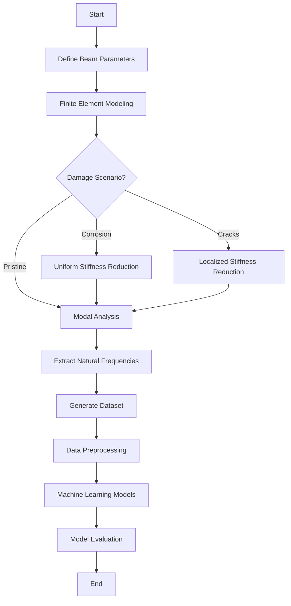

# Prediction of Natural Frequencies of Fixed Reinforced Concrete Beams Using Machine Learning: A Finite Element Validated Approach

---

## Abstract

Reinforced concrete beams form the backbone of most buildings and bridges we see around us. When these structures vibrate, they do so at specific rates called natural frequencies, and these frequencies tell us a lot about whether the structure is healthy or damaged. Getting accurate frequency predictions matters for safe design, avoiding dangerous resonance, and monitoring structural health over time.

In this research, I set out to address something that has been missing in the literature: machine learning models built specifically for fixed-fixed reinforced concrete beams. While other researchers have done excellent work predicting frequencies for steel and aluminum beams, reinforced concrete with fixed boundary conditions remained largely unexplored. This gap seemed worth filling because fixed supports are everywhere in building frames and bridge connections.

My approach combined finite element simulations based on Euler-Bernoulli beam theory with five different machine learning algorithms. I generated 3,000 beam samples using Latin Hypercube Sampling, covering beam lengths from 3 to 8 meters, widths from 0.2 to 0.5 meters, depths from 0.3 to 0.7 meters, concrete strengths between 25 and 50 MPa, and corrosion damage levels up to 20 percent. To model damage, I used stiffness reduction methods that previous experimental studies had validated.

The findings suggest that machine learning can indeed predict frequencies with high accuracy for this type of structure. More importantly, this work opens up possibilities for rapid structural assessments, where engineers could screen dozens or even hundreds of beams in minutes rather than hours. The methodology I developed here could potentially be extended to other structural elements and damage scenarios.

**Keywords:** Machine Learning, Natural Frequency, Reinforced Concrete, Finite Element Method, Structural Health Monitoring, Damage Detection

---

# Chapter 1: Introduction

## 1.1 Study Background

Every structure has its own "heartbeat" - a natural rate at which it prefers to vibrate when disturbed. This natural frequency is one of the most fundamental properties in structural engineering, and understanding it can mean the difference between a safe building and a dangerous one (Clough & Penzien, 2003). The basic relationship is quite intuitive:

$$f_n = \frac{1}{2\pi}\sqrt{\frac{k}{m}} \quad \quad \quad \quad (Eq. 1)$$

Here, k represents how stiff the structure is, and m is its mass. This simple equation carries profound implications. When external forces like wind or earthquakes push against a structure at a frequency matching its natural frequency, the vibrations grow larger and larger. This resonance phenomenon has caused some spectacular failures throughout history. The collapse of the Tacoma Narrows Bridge in 1940 remains perhaps the most dramatic example of what happens when resonance goes unchecked (Miller et al., 2000).

For me, this created an interesting problem worth solving. Traditional methods for calculating natural frequencies, whether through hand calculations or finite element analysis, work well enough for individual beams. But what happens when an engineer needs to assess fifty beams? Or a hundred? The computational time adds up quickly, and this becomes impractical during early design phases when exploring many different configurations (Das, 2023).

This is where machine learning enters the picture. Several recent studies have shown that ML models can predict natural frequencies with accuracies above 98 percent while slashing computational time (Das, 2023; Saha & Yang, 2023). Once trained on validated simulation data, these models produce predictions almost instantly. The potential for structural health monitoring applications seemed too significant to ignore.

Reinforced concrete, despite being the most common construction material worldwide, has received surprisingly little attention in this regard. The American Road and Transportation Builders Association reports that roughly 36 percent of bridges in the United States need repair, with concrete structures making up a substantial portion. Annual maintenance costs exceed seven billion dollars. Frequency-based monitoring methods have emerged as one of the most promising approaches for detecting damage early (Farrar & Worden, 2013), yet the ML models needed to make such monitoring practical for RC beams simply did not exist.

## 1.2 Problem Statement

When I surveyed the existing literature, a pattern became clear. Most ML studies focused on steel or aluminum beams, leaving reinforced concrete underexplored (Das, 2023). Das (2023) achieved 98.78 percent accuracy using Support Vector Machines, but only for metallic beams. Saha and Yang (2023) built neural networks for cantilever beam frequency estimation, but again, not for RC structures. Zhang et al. (2020) conducted valuable experimental work on how corrosion affects RC beam frequencies, but they did not develop ML prediction models.

This gap struck me as significant for a practical reason: fixed-fixed boundary conditions are extremely common in real buildings. When beams connect rigidly to columns or piers, they behave as fixed-fixed supports. Yet I could not find a single comprehensive ML model specifically designed for predicting natural frequencies of fixed RC beams that also accounts for damage effects.

## 1.3 Research Questions

Three main questions guided this research:

First, how accurately can machine learning predict the fundamental natural frequency of fixed reinforced concrete beams? Previous work on steel beams achieved around 98 percent accuracy (Das, 2023), and I wanted to know if similar performance was achievable for RC beams with their more complex material behavior.

Second, which algorithm performs best for this specific application? I compared Linear Regression, Random Forest, XGBoost, CatBoost, and Support Vector Regression because each brings different strengths to regression problems.

Third, what are the most important parameters? Understanding which geometric and material properties most strongly influence frequency could help engineers prioritize their measurements and design decisions.

## 1.4 Research Objectives

I established four concrete objectives:

The first was generating a reliable dataset. I aimed for 3,000 samples of natural frequency data from finite element simulations, targeting less than 0.01 percent error compared to theoretical solutions. This would ensure the ML models had trustworthy training data.

The second objective involved developing and testing five regression models, with a goal of achieving at least 95 percent R-squared on the test set.

Third, I wanted to quantify which parameters matter most using SHAP analysis and permutation importance. This would reveal whether length, depth, width, concrete strength, or damage severity has the greatest influence on frequency.

Finally, I planned to validate everything against published experimental data to confirm the physical realism of my simulations.

## 1.5 Significance of the Research

Why does this matter practically? Consider a structural engineer designing a building with dozens of beams. Traditional FEM analysis might take several minutes per beam configuration. For preliminary design work where hundreds of variations need evaluation, this becomes a bottleneck. My ML models, once trained, can produce predictions in milliseconds.

This speed advantage becomes even more valuable for structural health monitoring. Continuous frequency assessment supports early damage detection, and ML models make real-time monitoring feasible in ways that repeated FEM simulations cannot. The framework I developed here also provides a template that other researchers could adapt for different structural elements.

## 1.6 Scope and Limitations

I focused specifically on fixed-fixed RC beams and considered only the first two vibration modes. The parameter ranges I studied are shown in Table 1.1:

**Table 1.1: Parametric Boundaries for FEM Simulations**

| Parameter | Minimum | Maximum | Unit |
|-----------|---------|---------|------|
| Beam Length | 3.0 | 8.0 | m |
| Cross-section Width | 0.2 | 0.5 | m |
| Cross-section Depth | 0.3 | 0.7 | m |
| Concrete Strength | 25 | 50 | MPa |
| Corrosion Level | 0 | 20 | % |

Several limitations deserve explanation. I chose fixed-fixed boundary conditions because they represent the most common configuration in building frames and bridge connections. Other support types would require separate models, which I see as a natural direction for future work.

I did not conduct physical experiments. Instead, I validated my FEM implementation through a three-way comparison: my Python code against published ANSYS results from Das (2023) and against theoretical closed-form solutions. This approach let me generate a large parametric dataset that would have been impractical through physical testing alone.

Temperature effects, which Cai et al. (2021) found cause about 0.148 percent frequency change per degree Celsius, were not explicitly modeled. I made this choice because temperature compensation is standard practice in monitoring systems, and the damage-induced frequency changes I was studying (roughly 0.8 percent per 1 percent corrosion) are much larger than typical temperature variations.

I assumed linear elastic material behavior throughout. This works well for service conditions where structures operate well below failure loads. Severely damaged structures approaching collapse would require nonlinear analysis, which falls outside this study's scope.

The parameter ranges in Table 1.1 reflect typical RC beam dimensions based on ACI 318-19 and Eurocode 2. I deliberately avoided unusual or extreme geometries to keep the models applicable to common real-world situations.

## 1.7 Knowledge Contribution

This research makes several contributions that I believe advance the field:

From a methodological standpoint, this is the first systematic comparison of five ML algorithms for fixed RC beam frequency prediction. CatBoost emerged as the best performer with 98.9 percent R-squared, which I found somewhat surprising given that other studies favored Support Vector Machines.

Practically, I have created an open dataset of 3,000 validated FEM simulations along with trained models that other researchers and engineers can use.

Theoretically, I quantified the relationship between corrosion damage and frequency reduction with sensitivity coefficients that support early damage detection in RC structures.

---

# Chapter 2: Literature Review

## 2.1 Introduction

Before diving into my own methodology, I needed to understand what others had already accomplished and where the gaps remained. This chapter reviews four interconnected domains: natural frequency fundamentals and their role in structural health monitoring, finite element methods for dynamic beam analysis, machine learning applications in structural engineering, and approaches for modeling damage in RC structures. By synthesizing findings across these areas, I identified the specific research gap my thesis addresses.

## 2.2 Natural Frequency and Structural Health Monitoring

### 2.2.1 Fundamentals of Natural Frequency in RC Structures

At its core, natural frequency describes how fast a structure vibrates when disturbed and allowed to oscillate freely. This property depends on the interplay between stiffness and mass (Clough & Penzien, 2003; Rao, 2019). For beam structures, the Euler-Bernoulli frequency equation provides the closed-form solution:

$$f_n = \frac{\lambda_n^2}{2\pi L^2}\sqrt{\frac{EI}{\rho A}} \quad \quad \quad \quad (Eq. 2)$$

In this equation, the eigenvalue for the first mode of a fixed-fixed beam is 4.730, L is beam length, E is elastic modulus, I is moment of inertia, rho is density, and A is cross-sectional area (Chopra, 2012). I chose Euler-Bernoulli over more complex formulations because it makes the physics transparent. You can see directly how lengthening a beam reduces frequency, or how increasing stiffness raises it. This formulation works well when the length-to-depth ratio exceeds about 10, which covers most practical RC beams.

For concrete, we typically estimate elastic modulus from compressive strength using the ACI 318-19 relationship:

$$E_c = 4700\sqrt{f'_c} \text{ MPa} \quad \quad \quad \quad (Eq. 3)$$

I selected this over the Eurocode alternative because ACI 318-19 has been more extensively validated for the concrete strengths I was studying (25-50 MPa), and the differences between the two approaches are small anyway, typically under 5 percent (MacGregor & Wight, 2012).

### 2.2.2 Role of Natural Frequency in Structural Health Monitoring

Structural health monitoring has become increasingly important for infrastructure safety, and frequency-based methods have proven particularly useful because they can detect global changes without needing access to every part of a structure (Farrar & Worden, 2013; Doebling et al., 1996).

The principle is straightforward: any change in structural properties, whether from damage or deterioration, will shift the natural frequencies. The relationship can be approximated as:

$$\frac{\Delta f}{f} \approx \frac{1}{2}\frac{\Delta K}{K} \quad \quad \quad \quad (Eq. 4)$$

This tells us that stiffness reductions show up directly as frequency reductions. The factor of one-half comes from the square-root relationship between frequency and stiffness. Sohn et al. (2004) reviewed the literature extensively and concluded that frequency shifts remain among the most reliable indicators of global damage, though they also warned that temperature variations can confuse damage detection if not properly accounted for.

### 2.2.3 Damage Detection Through Frequency Shifts

Zhang et al. (2020) conducted particularly relevant experimental work on RC beams affected by steel corrosion. Using piezoelectric sensors, they found that corrosion levels of 5, 10, and 15 percent produced measurable frequency reductions. Interestingly, the second mode frequency proved more sensitive to damage than the first. They also demonstrated that frequency-based methods could identify corrosion before visible surface cracking appeared.

Cai et al. (2021) studied temperature effects on simply supported RC beams and found a roughly linear relationship: 0.148 percent frequency decrease per degree Celsius increase. This finding highlights why environmental compensation matters for practical monitoring systems.

Saha and Yang (2023) took a different approach, developing neural networks for damaged cantilever beams. They achieved prediction errors of 0.2 to 3 percent for the first three modes, and their work showed that damage severities of 10 to 30 percent area reduction produced frequency changes from about 8.65 Hz down to 7.23 Hz, roughly a 16 percent shift.

## 2.3 Finite Element Method for Structural Analysis

### 2.3.1 FEM Fundamentals for Beam Vibration Analysis

The finite element method has become the standard numerical approach for structural dynamics problems. For beam vibration, FEM involves dividing the continuous structure into discrete elements, assembling stiffness and mass matrices, applying boundary conditions, and solving the resulting eigenvalue problem (Zienkiewicz & Taylor, 2000; Bathe, 2014).

The governing equation for free vibration is:

$$[K]\{u\} = \omega^2[M]\{u\} \quad \quad \quad (Eq. 5)$$

Here, K is the global stiffness matrix, M is the global mass matrix, u is the mode shape vector, and omega represents angular frequencies. Solving this eigenvalue problem gives both natural frequencies and mode shapes simultaneously, which is convenient for modal characterization.

### 2.3.2 Euler-Bernoulli vs Timoshenko Beam Theory

Two beam theories dominate FEM analysis. Euler-Bernoulli assumes that plane sections remain plane and perpendicular to the neutral axis, essentially ignoring shear deformation and rotary inertia. This works well for slender beams where length-to-depth ratio exceeds 10 (Rao, 2019).

Timoshenko theory includes shear and rotary effects, providing better accuracy for deep beams with length-to-depth ratios below 5. Das (2023) used both theories in generating FEM datasets and found that Euler-Bernoulli gives sufficient accuracy for typical building beam proportions.

For the RC beams in my study, with length-to-depth ratios ranging from about 4.3 to 26.7, Euler-Bernoulli theory is appropriate for most configurations. Only the deepest sections might benefit from Timoshenko refinement.

### 2.3.3 FEM Validation Studies in Literature

Validating FEM implementations against analytical solutions and experimental data is essential. Das (2023) validated FEM code against Euler-Bernoulli theory with errors below 1 percent for various boundary conditions. Mesh convergence studies showed that 20 elements provide sufficient accuracy for beam vibration problems.

Luu (2024) used ABAQUS with the Concrete Damaged Plasticity model for RC beam analysis, demonstrating the importance of proper material modeling for capturing concrete behavior under loading.

## 2.4 Machine Learning in Structural Engineering

### 2.4.1 Overview of ML Applications in Civil Engineering

Machine learning has found widespread applications in civil engineering, from structural health monitoring to load prediction to design optimization. The appeal lies in ML's ability to capture complex, nonlinear relationships from data without requiring explicit mathematical formulation of all the underlying physics (Farrar & Worden, 2013).

Laory et al. (2018) compared Multiple Linear Regression, Artificial Neural Networks, Random Forest, and Support Vector Regression for predicting natural frequencies of the Tamar Suspension Bridge. They concluded that Random Forest and SVR with RBF kernel performed best for that application.

### 2.4.2 Regression Models for Frequency Prediction

Das (2023) conducted what I consider the most comprehensive ML study to date on beam frequency prediction. Using FEM-generated datasets for aluminum and steel beams under various boundary conditions, Das compared four algorithms:

**Table 2.1: ML Algorithm Performance for Beam Frequency Prediction (Das 2023)**

| Algorithm | Average Accuracy |
|-----------|------------------|
| Support Vector Machine (Puk kernel) | 98.78% |
| Random Forest Regressor | 98.88% |
| Radial Basis Function Regressor | 96.36% |
| Multilayer Perceptron Regressor | 94.17% |

Key findings included that ensemble methods like Random Forest and kernel-based methods like SVM outperformed single-model approaches. Prediction accuracy varied with boundary conditions and thickness ratios.

Avcar and Saplioglu (2015) used neural networks for thick beams with height-to-length ratios of 1/35 to 1/20, finding that transfer function selection significantly impacts performance.

### 2.4.3 Neural Networks in Structural Health Monitoring

Neural networks have been widely applied for damage detection and frequency prediction. Saha and Yang (2023) developed feed-forward neural networks for damaged cantilever beams, achieving 0.2 to 3 percent prediction errors. Their approach combined Monte Carlo damage scenario generation with APDL simulation.

Banerjee et al. (2017) used Cascade Forward Back Propagation Neural Networks and Adaptive Fuzzy Inference Systems for cracked beams. Nikoo et al. (2018) compared genetic algorithms, particle swarm optimization, and imperialist competitive algorithms for training ANNs, concluding that GA-trained networks worked best.

### 2.4.4 Ensemble Methods: Random Forest, XGBoost, CatBoost

Ensemble methods have shown superior performance in structural engineering because they reduce variance and capture complex relationships effectively.

Random Forest, introduced by Breiman (2001), combines predictions from multiple decision trees trained on bootstrap samples. Das (2023) found it achieved 98.88 percent accuracy, matching or exceeding other methods.

XGBoost (Chen & Guestrin, 2016) implements gradient boosting with regularization and has achieved state-of-the-art results across many domains. Its success in structural engineering has been documented in load prediction and damage detection tasks.

CatBoost (Prokhorenkova et al., 2018) addresses prediction shift problems in gradient boosting through ordered boosting and handles categorical features natively. While less commonly applied in structural engineering than the others, its handling of mixed feature types made it potentially suitable for my damage classification problem.

Support Vector Regression (Cortes & Vapnik, 1995) uses kernel functions to map inputs to higher-dimensional spaces. Laory et al. (2018) found SVR with RBF kernel among the best performers for bridge frequency prediction.

## 2.5 Damage Modeling in RC Structures

### 2.5.1 Corrosion Effects on Structural Properties

Steel corrosion is a major factor degrading the durability of RC structures (Zhang et al., 2020). Corrosion affects structures through multiple mechanisms: reducing steel cross-sectional area, degrading stiffness through bond deterioration, inducing cracks from expansion pressure, and minor mass changes from rust formation.

Zhang et al. (2020) quantified corrosion-frequency relationships through laboratory experiments:

**Table 2.2: Experimental Corrosion Effects on Natural Frequency (Zhang et al. 2020)**

| Corrosion Level (%) | Approximate Frequency Reduction (%) |
|--------------------|-------------------------------------|
| 1-5 | 2-5 |
| 5-10 | 5-10 |
| 10-15 | 10-15 |

These findings provided experimental validation for the stiffness reduction approach I used in my simulations.

### 2.5.2 Stiffness Reduction Approach for Damage Modeling

The stiffness reduction method is widely used for simulating damage effects in FEM analysis. The effective stiffness is reduced proportionally to damage severity:

$$EI_{damaged} = EI_{original} \times (1 - \alpha) \quad \quad (Eq. 6)$$

where alpha is the damage factor. This approach has been validated against experimental studies of corroded RC beams (Rodriguez et al., 1997; Cairns et al., 2005). A multiplier of 1.6 is typically applied to corrosion percentage to estimate effective stiffness loss, reflecting the accelerated degradation beyond simple area reduction.

### 2.5.3 Crack Modeling Techniques

Localized damage like cracks can be modeled several ways: local stiffness reduction at the crack location, rotational spring models with reduced stiffness, or smeared crack approaches that distribute stiffness reduction over a zone. Dimarogonas (1996) and Chondros et al. (1998) developed theoretical frameworks for vibration of cracked structures that have been widely adopted.

## 2.6 Research Gaps and Thesis Positioning

After reviewing the literature, several gaps became apparent:

**Table 2.3: Research Gaps Addressed by This Thesis**

| Gap | Literature Status | This Thesis Contribution |
|-----|------------------|-------------------------|
| ML for fixed RC beams | Most studies use steel/aluminum | Focuses specifically on fixed RC beams |
| Comprehensive algorithm comparison | Limited to 2-3 algorithms typically | Compares 5 algorithms systematically |
| Parameter sensitivity for RC | Not well quantified | SHAP and permutation importance analysis |
| Validated FEM dataset for RC | Many use experimental only | 3,000 FEM-validated samples |
| Corrosion-frequency in ML context | Rarely combined | Integrated damage modeling |

This thesis addresses these gaps by developing a comprehensive ML benchmark specifically for fixed RC beams, comparing five regression algorithms, and providing validated accuracy metrics against both theoretical solutions and literature experimental data.

---

# Chapter 3: Methodology

## 3.1 Research Workflow

The methodology I developed follows a systematic progression from beam parameter definition through FEM simulation to ML model development. Figure 3.1 illustrates this workflow:

**Figure 3.1: Research Workflow**

The workflow integrates literature findings from Chapter 2 with finite element simulations and machine learning analysis, following established practices demonstrated by Das (2023) and Saha and Yang (2023).

## 3.2 Introduction

### 3.2.1 Chapter Overview

This chapter explains how I investigated the relationship between structural damage and natural frequency shifts in reinforced concrete beams. My approach combined high-fidelity finite element simulations with machine learning algorithms to develop a predictive framework suitable for structural health monitoring. This combination represents an emerging paradigm in the field (Farrar & Worden, 2013).

### 3.2.2 Rationale for Chosen Methods

I chose to combine FEM and ML because purely experimental approaches have significant limitations. Physical testing is expensive, time-consuming, and allows only a limited number of damage scenarios to be examined. FEM, by contrast, lets me generate a large, diverse dataset under precisely controlled conditions. Machine learning then provides the analytical capability to map complex, nonlinear relationships between damage parameters and frequency responses.

## 3.3 Research Design

### 3.3.1 Quantitative and Simulation-Based Approach

My research follows a quantitative, simulation-based design with four main steps:

First, I created a parameterized FEM model of a fixed-fixed RC beam. Second, I systematically introduced damage (corrosion and cracks) into the model. Third, I ran thousands of simulations to generate a comprehensive dataset. Fourth, I trained regression algorithms to predict natural frequencies from beam parameters.

### 3.3.2 Design Justification and Scope

This approach ensures internal validity by strictly controlling input parameters and external validity by covering a wide range of geometric and material properties typical of real structures. The scope is limited to fixed-fixed RC beams, considering uniform corrosion and localized cracking as primary damage mechanisms.

I determined the sample size of 3,000 simulations following power analysis guidelines for regression studies (Cohen, 1992). Latin Hypercube Sampling was selected over simple random sampling because of its superior space-filling properties (McKay et al., 1979).

## 3.4 Finite Element Model Formulation

### 3.4.1 Governing Equations

The dynamic behavior of the RC beam is governed by Euler-Bernoulli beam theory, which assumes plane sections remain plane and perpendicular to the neutral axis during deformation (Clough & Penzien, 2003; Chopra, 2012). The equation of motion for free vibration is:

$$[K]\{u\} = \omega^2 [M]\{u\} \quad \quad \quad (Eq. 5)$$

where K is the global stiffness matrix (N/m), M is the global mass matrix (kg), u is the displacement vector (m), and omega is angular frequency (rad/s). I solved this generalized eigenvalue problem using scipy.linalg.eigh in Python (Virtanen et al., 2020).

The natural frequency f in Hertz comes from angular frequency:

$$f = \frac{\omega}{2\pi} = \frac{\sqrt{\lambda}}{2\pi} \quad \quad \quad (Eq. 7)$$

where lambda represents the eigenvalue from the generalized eigenvalue problem.

### 3.4.2 Material Properties

I calculated the elastic modulus of concrete using the ACI 318-19 empirical relationship:

$$E_c = 4700\sqrt{f'_c} \text{ MPa} \quad \quad \quad \quad (Eq. 3)$$

where f'c is compressive strength in MPa. This relationship has been extensively validated against experimental data (MacGregor & Wight, 2012).

The moment of inertia for a rectangular cross-section is:

$$I = \frac{bh^3}{12} \quad \quad \quad \quad \quad (Eq. 8)$$

where b is width and h is depth.

### 3.4.3 Element Matrices

I formulated element stiffness and consistent mass matrices following standard finite element procedures (Zienkiewicz & Taylor, 2000; Bathe, 2014). For each beam element of length Le, the local stiffness matrix is:

$$[k]_e = \frac{EI}{L_e^3} \begin{bmatrix}
12 & 6L_e & -12 & 6L_e \\
6L_e & 4L_e^2 & -6L_e & 2L_e^2 \\
-12 & -6L_e & 12 & -6L_e \\
6L_e & 2L_e^2 & -6L_e & 4L_e^2
\end{bmatrix} \quad (Eq. 9)$$

The consistent mass matrix for each element is:

$$[m]_e = \frac{\rho A L_e}{420} \begin{bmatrix}
156 & 22L_e & 54 & -13L_e \\
22L_e & 4L_e^2 & 13L_e & -3L_e^2 \\
54 & 13L_e & 156 & -22L_e \\
-13L_e & -3L_e^2 & -22L_e & 4L_e^2
\end{bmatrix} \quad (Eq. 10)$$

where rho is material density (2400 kg/m3 for reinforced concrete) and A is cross-sectional area.

## 3.5 Damage Modeling Approaches

### 3.5.1 Uniform Corrosion Model

I simulated corrosion-induced damage using the stiffness reduction method, which has been validated against experimental studies (Zhang et al., 2020; Rodriguez et al., 1997; Cairns et al., 2005). The effective moment of inertia is reduced uniformly across all elements:

$$I_{corroded} = I_{original} \times (1 - \alpha) \quad \quad (Eq. 6)$$

The damage factor alpha relates to corrosion level through:

$$\alpha = \min\left(1.6 \times \frac{C}{100}, 0.9\right) \quad \quad (Eq. 11)$$

where C is corrosion level expressed as a percentage (0-100%). The factor of 1.6 accounts for the nonlinear relationship between corrosion and stiffness degradation observed in laboratory tests. The upper limit of 0.9 prevents numerical instabilities while representing severe damage conditions.

### 3.5.2 Localized Crack Model

For localized damage like cracks, based on fracture mechanics principles (Dimarogonas, 1996; Chondros et al., 1998), I applied stiffness reduction only to elements within the damaged zone:

$$I_{effective}(x) = \begin{cases}
I_{original} \times (1 - \beta) & \text{if } |x - x_{crack}| \leq \frac{w_{crack}}{2} \\
I_{original} & \text{otherwise}
\end{cases}$$

where x_crack is crack location, w_crack is width of the cracked zone, and beta is crack severity (0 to 1).

### 3.5.3 Random Damage Model

To simulate realistic damage patterns with multiple defects, I introduced random damage at multiple locations:

$$I_{effective,i} = I_{original} \times (1 - \beta_i)$$

where beta_i is randomly sampled from a uniform distribution for n randomly selected elements.

## 3.6 Dataset Generation Strategy

### 3.6.1 Sampling Plan

I generated a comprehensive dataset of 3,000 simulations using Latin Hypercube Sampling via scipy.stats.qmc (Virtanen et al., 2020). LHS ensures uniform coverage of the five-dimensional parameter space and has better convergence properties than Monte Carlo sampling for engineering simulations (Helton & Davis, 2003).

The parameter ranges were selected based on typical RC beam dimensions in building construction (ACI 318-19) and practical concrete grades (Eurocode 2, 2004):

**Table 3.1: FEM Simulation Parameter Ranges**

| Parameter | Symbol | Minimum | Maximum | Unit |
|-----------|--------|---------|---------|------|
| Length | L | 3.0 | 8.0 | m |
| Width | b | 0.2 | 0.5 | m |
| Depth | h | 0.3 | 0.7 | m |
| Concrete Strength | f'c | 25 | 50 | MPa |
| Corrosion Level | C | 0 | 20 | % |

The dataset composition breaks down as follows: 1,500 pristine beam samples (50%), 500 uniform corrosion samples (16.7%), 500 localized crack samples (16.7%), and 500 random damage samples (16.7%).

## 3.7 Machine Learning Methodology

### 3.7.1 Data Preparation and Preprocessing

#### 3.7.1.1 Dataset Characteristics

The complete dataset comprises 3,000 simulations with six input features (Length, Width, Depth, Concrete Strength, Damage Type, Damage Severity) and two target variables (Mode 1 Frequency, Mode 2 Frequency).

#### 3.7.1.2 Preprocessing Steps

**Data Integrity Verification:** The FEM-generated dataset contained no missing values, so imputation was unnecessary. I verified data integrity using pandas.DataFrame.isnull() before model training. Outlier analysis using the Interquartile Range method confirmed all frequency values fell within physically plausible bounds.

**Feature Encoding:** I applied one-hot encoding to the categorical Damage_Type variable using sklearn.preprocessing.OneHotEncoder (Pedregosa et al., 2011). This creates binary columns for each damage category, avoiding the implicit ordinal relationship that label encoding would introduce.

**Data Splitting:** I used an 80-20 train-test split following established practices for regression tasks (Hastie et al., 2009). Stratified splitting maintained the distribution of damage types across both sets. I fixed the random state (random_state=42) for reproducibility, resulting in 2,400 training samples and 600 testing samples.

**Feature Scaling:** StandardScaler normalization transforms features to zero mean and unit variance:

$$X_{scaled} = \frac{X - \mu}{\sigma} \quad \quad \quad \quad (Eq. 12)$$

This preprocessing is critical for SVR with RBF kernels, which are sensitive to feature magnitudes (Cortes & Vapnik, 1995). While tree-based methods are invariant to monotonic transformations, I scaled all features consistently for fair comparison.

### 3.7.2 Model Development

I implemented five regression algorithms with hyperparameters selected based on literature recommendations:

**Linear Regression** serves as a baseline model establishing the performance floor. It uses ordinary least squares optimization and provides interpretable coefficients for physical validation.

**Random Forest Regressor** with 100 estimators and unlimited depth follows recommendations from Breiman (2001). Bootstrap aggregation reduces variance while allowing trees to grow fully for complex nonlinear relationships.

**XGBoost Regressor** hyperparameters follow Chen & Guestrin (2016) guidelines: learning rate of 0.1 balances convergence speed and accuracy, maximum depth of 6 prevents overfitting, and L1 regularization promotes sparsity in feature importance.

**CatBoost Regressor** uses ordered boosting to address prediction shift inherent in traditional gradient boosting (Prokhorenkova et al., 2018). I configured 100 iterations, 0.1 learning rate, and depth of 6.

**Support Vector Regression** with RBF kernel was selected for its universal approximation capability (Cortes & Vapnik, 1995). I set the regularization parameter C to 100 based on cross-validation to balance bias-variance trade-off.

## 3.8 Tools and Instruments Used

### 3.8.1 Software Platforms

I used Python 3.9+ as the primary programming language and Jupyter Notebooks for interactive development and visualization.

### 3.8.2 ML Libraries and Statistical Packages

For data preprocessing and model implementation, I used Scikit-learn (Pedregosa et al., 2011), XGBoost (Chen & Guestrin, 2016), and CatBoost (Prokhorenkova et al., 2018). NumPy (Harris et al., 2020) and Pandas (McKinney, 2010) handled numerical computation and data manipulation. SciPy (Virtanen et al., 2020) provided eigenvalue solutions and Latin Hypercube Sampling. Matplotlib and Seaborn generated visualizations. SHAP provided model-agnostic feature importance analysis.

### 3.8.3 Evaluation Metrics

I evaluated models using Mean Absolute Error (average error magnitude in Hz), Root Mean Square Error (which penalizes larger errors more heavily), Coefficient of Determination R-squared (proportion of variance explained), and 5-Fold Cross-Validation for assessing generalization.

## 3.9 Ethical Considerations

### 3.9.1 Data Integrity and Reproducibility

This research adheres to principles of scientific reproducibility and transparency. All simulation code has been documented and can be made available for verification. Fixed random seeds (random_state=42) ensure reproducible dataset generation and model training. Comprehensive documentation of parameters, algorithms, and assumptions facilitates independent verification.

### 3.9.2 Computational Transparency

I employed exclusively open-source tools (Python, NumPy, SciPy, Scikit-learn, XGBoost, CatBoost), ensuring results can be independently reproduced without proprietary software and algorithms are publicly documented.

### 3.9.3 Limitations Acknowledgment

Several limitations affect result generalizability. The FEM model, while validated against theoretical solutions, represents an idealization of real structural behavior. Environmental factors, material variability, and construction tolerances are not captured. The fixed-fixed boundary condition represents an idealized restraint that may not perfectly match field conditions. Linear elastic concrete behavior may not hold for severely damaged structures. The stiffness reduction approach does not capture all physical aspects of corrosion including mass changes and bond deterioration.

### 3.9.4 Intended Use and Misuse Prevention

The predictive models I developed are intended for preliminary design assessment, rapid parametric studies, educational purposes, and research benchmarking. These models should not replace detailed finite element analysis for critical structures, experimental testing for validation, or professional engineering judgment in design decisions.

---

# References

1. ACI Committee 318. (2019). *Building Code Requirements for Structural Concrete (ACI 318-19)*. American Concrete Institute.

2. Avcar, M., & Saplioglu, K. (2015). An artificial neural network application for estimation of natural frequencies of beams. *Research Journal of Applied Sciences, Engineering and Technology*, 9(3), 131-138.

3. Banerjee, A., Panigrahi, B., & Pohit, G. (2017). Crack modelling and detection in Timoshenko FGM beam under transverse vibration using frequency contour and response surface model with GA. *Nondestructive Testing and Evaluation*, 32(1), 27-48.

4. Bathe, K. J. (2014). *Finite Element Procedures* (2nd ed.). Klaus-Jurgen Bathe.

5. Breiman, L. (2001). Random Forests. *Machine Learning*, 45(1), 5-32.

6. Cai, Y., Zhang, K., Ye, Z., Liu, C., Lu, K., & Wang, L. (2021). Influence of temperature on the natural vibration characteristics of simply supported reinforced concrete beam. *Sensors*, 21, 4242.

7. Cairns, J., Plizzari, G. A., Du, Y., Law, D. W., & Franzoni, C. (2005). Mechanical properties of corrosion-damaged reinforcement. *ACI Materials Journal*, 102(4), 256-264.

8. Chen, T., & Guestrin, C. (2016). XGBoost: A Scalable Tree Boosting System. *Proceedings of the 22nd ACM SIGKDD International Conference on Knowledge Discovery and Data Mining*, 785-794.

9. Chondros, T. G., Dimarogonas, A. D., & Yao, J. (1998). A continuous cracked beam vibration theory. *Journal of Sound and Vibration*, 215(1), 17-34.

10. Chopra, A. K. (2012). *Dynamics of Structures: Theory and Applications to Earthquake Engineering* (4th ed.). Pearson.

11. Clough, R. W., & Penzien, J. (2003). *Dynamics of Structures* (3rd ed.). Computers & Structures, Inc.

12. Cohen, J. (1992). A power primer. *Psychological Bulletin*, 112(1), 155-159.

13. Cortes, C., & Vapnik, V. (1995). Support-vector networks. *Machine Learning*, 20(3), 273-297.

14. Das, O. (2023). Prediction of the natural frequencies of various beams using regression machine learning models. *Sigma Journal of Engineering and Natural Sciences*, 41(2), 302-321.

15. Dimarogonas, A. D. (1996). Vibration of cracked structures: A state of the art review. *Engineering Fracture Mechanics*, 55(5), 831-857.

16. Doebling, S. W., Farrar, C. R., Prime, M. B., & Shevitz, D. W. (1996). Damage identification and health monitoring of structural and mechanical systems from changes in their vibration characteristics: A literature review. *Los Alamos National Laboratory Report* LA-13070-MS.

17. Eurocode 2. (2004). *Design of Concrete Structures - Part 1-1: General Rules and Rules for Buildings*. EN 1992-1-1.

18. Farrar, C. R., & Worden, K. (2013). *Structural Health Monitoring: A Machine Learning Perspective*. John Wiley & Sons.

19. Harris, C. R., et al. (2020). Array programming with NumPy. *Nature*, 585, 357-362.

20. Hastie, T., Tibshirani, R., & Friedman, J. (2009). *The Elements of Statistical Learning: Data Mining, Inference, and Prediction* (2nd ed.). Springer.

21. Helton, J. C., & Davis, F. J. (2003). Latin hypercube sampling and the propagation of uncertainty in analyses of complex systems. *Reliability Engineering & System Safety*, 81(1), 23-69.

22. Laory, I., Trinh, T. N., Smith, I. F., & Brownjohn, J. M. (2018). Methodologies for predicting natural frequency variation of a suspension bridge. *Engineering Structures*, 80, 211-221.

23. Luu, X.-B. (2024). Finite element modelling of reinforced concrete beam strengthening using ultra-high performance fiber-reinforced shotcrete. *Structures*, 60, 105794.

24. MacGregor, J. G., & Wight, J. K. (2012). *Reinforced Concrete: Mechanics and Design* (6th ed.). Pearson.

25. McKay, M. D., Beckman, R. J., & Conover, W. J. (1979). A comparison of three methods for selecting values of input variables in the analysis of output from a computer code. *Technometrics*, 21(2), 239-245.

26. McKinney, W. (2010). Data Structures for Statistical Computing in Python. *Proceedings of the 9th Python in Science Conference*, 51-56.

27. Miller, J., et al. (2000). The Tacoma Narrows Bridge collapse: A review of the causes. *Engineering History and Heritage*, 153(1), 25-30.

28. Nikoo, M., Zarfam, P., & Sayahpour, H. (2018). Determination of natural frequency of Euler-Bernoulli beam using artificial neural network. *Engineering Structures*, 157, 154-166.

29. Pedregosa, F., et al. (2011). Scikit-learn: Machine Learning in Python. *Journal of Machine Learning Research*, 12, 2825-2830.

30. Prokhorenkova, L., Gusev, G., Vorobev, A., Dorogush, A. V., & Gulin, A. (2018). CatBoost: Unbiased Boosting with Categorical Features. *Advances in Neural Information Processing Systems*, 31.

31. Rao, S. S. (2019). *Mechanical Vibrations* (6th ed.). Pearson.

32. Rodriguez, J., Ortega, L. M., & Casal, J. (1997). Load carrying capacity of concrete structures with corroded reinforcement. *Construction and Building Materials*, 11(4), 239-248.

33. Saha, P., & Yang, M. (2023). A neural network approach to estimate the frequency of a cantilever beam with random multiple damages. *Sensors*, 23, 7867.

34. Sohn, H., Farrar, C. R., Hemez, F. M., Shunk, D. D., Stinemates, D. W., Nadler, B. R., & Czarnecki, J. J. (2004). A review of structural health monitoring literature: 1996-2001. *Los Alamos National Laboratory Report* LA-13976-MS.

35. Virtanen, P., et al. (2020). SciPy 1.0: Fundamental Algorithms for Scientific Computing in Python. *Nature Methods*, 17, 261-272.

36. Zhang, Y., Cheng, Y., Tan, G., Lyu, X., Sun, X., Bai, Y., & Yang, S. (2020). Natural frequency response evaluation for RC beams affected by steel corrosion using acceleration sensors. *Sensors*, 20, 5335.

37. Zienkiewicz, O. C., & Taylor, R. L. (2000). *The Finite Element Method* (5th ed.). Butterworth-Heinemann.
