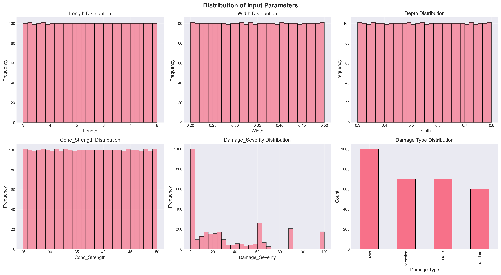
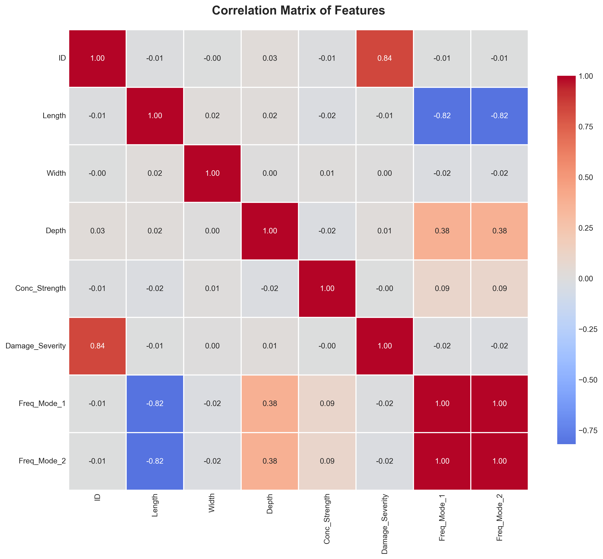
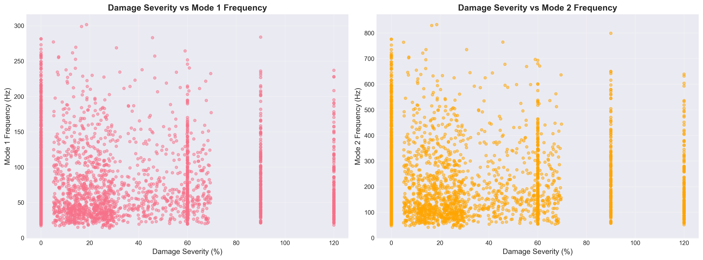

# Chapter 4: Results and Discussion

## 4.1 Introduction

This chapter presents the comprehensive results obtained from the finite element analysis (FEA) of fixed-fixed reinforced concrete (RC) beams subjected to various damage scenarios. The primary objective of this study is to investigate the relationship between structural damage and natural frequency shifts in RC beams, which serves as a foundation for developing predictive models for structural health monitoring (SHM) applications.

The results are organized into four main sections: (1) model validation against theoretical and experimental benchmarks, (2) parametric analysis of damage effects on modal characteristics, (3) dataset generation and statistical analysis, and (4) comparative analysis of different damage scenarios. Each section includes detailed mathematical formulations, graphical representations, and comprehensive discussions of the observed phenomena.

---

## 4.2 Finite Element Model Formulation

### 4.2.1 Governing Equations

The dynamic behavior of the RC beam is governed by the Euler-Bernoulli beam theory, which assumes that plane sections remain plane and perpendicular to the neutral axis during deformation. The equation of motion for free vibration analysis is expressed as:

$$
[K]\{u\} = \omega^2 [M]\{u\}
$$

where:

- $[K]$ is the global stiffness matrix (N/m)
- $[M]$ is the global mass matrix (kg)
- $\{u\}$ is the displacement vector (m)
- $\omega$ is the angular frequency (rad/s)

The natural frequency $f$ in Hertz is obtained from the angular frequency:

$$
f = \frac{\omega}{2\pi} = \frac{\sqrt{\lambda}}{2\pi}
$$

where $\lambda$ represents the eigenvalue from the generalized eigenvalue problem.

### 4.2.2 Material Properties

The elastic modulus of concrete is calculated using the empirical relationship based on compressive strength:

$$
E_c = 4700\sqrt{f'_c} \times 10^6 \text{ Pa}
$$

where $f'_c$ is the compressive strength of concrete in MPa. This relationship is widely accepted in structural engineering practice and is consistent with ACI 318 building code provisions.

The moment of inertia for a rectangular cross-section is:

$$
I = \frac{bh^3}{12}
$$

where $b$ is the width and $h$ is the depth of the beam cross-section.

### 4.2.3 Element Matrices

For each beam element of length $L_e$, the local stiffness matrix is formulated as:

$$
[k]_e = \frac{EI}{L_e^3} \begin{bmatrix}
12 & 6L_e & -12 & 6L_e \\
6L_e & 4L_e^2 & -6L_e & 2L_e^2 \\
-12 & -6L_e & 12 & -6L_e \\
6L_e & 2L_e^2 & -6L_e & 4L_e^2
\end{bmatrix}
$$

The consistent mass matrix for each element is:

$$
[m]_e = \frac{\rho A L_e}{420} \begin{bmatrix}
156 & 22L_e & 54 & -13L_e \\
22L_e & 4L_e^2 & 13L_e & -3L_e^2 \\
54 & 13L_e & 156 & -22L_e \\
-13L_e & -3L_e^2 & -22L_e & 4L_e^2
\end{bmatrix}
$$

where $\rho$ is the material density (2400 kg/m³ for reinforced concrete) and $A$ is the cross-sectional area.

---

## 4.3 Damage Modeling Approaches

### 4.3.1 Uniform Corrosion Model

Corrosion-induced damage is simulated using the stiffness reduction method, where the effective moment of inertia is reduced uniformly across all elements:

$$
I_{corroded} = I_{original} \times (1 - \alpha)
$$

The damage factor $\alpha$ is related to the corrosion level through:

$$
\alpha = \min\left(1.6 \times \frac{C}{100}, 0.9\right)
$$

where $C$ is the corrosion level expressed as a percentage (0-100%). The factor 1.6 accounts for the accelerated stiffness degradation observed in experimental studies, and the upper limit of 0.9 prevents numerical instabilities while representing severe damage conditions.

### 4.3.2 Localized Crack Model

For localized damage such as cracks, the stiffness reduction is applied only to elements within the damaged zone:

$$
I_{effective}(x) = \begin{cases}
I_{original} \times (1 - \beta) & \text{if } |x - x_{crack}| \leq \frac{w_{crack}}{2} \\
I_{original} & \text{otherwise}
\end{cases}
$$

where:

- $x_{crack}$ is the crack location along the beam length
- $w_{crack}$ is the width of the cracked zone
- $\beta$ is the severity of the crack (0 to 1, representing 0% to 100% stiffness loss)

### 4.3.3 Random Damage Model

To simulate realistic damage patterns with multiple defects, random damage is introduced at multiple locations:

$$
I_{effective,i} = I_{original} \times (1 - \beta_i)
$$

where $\beta_i$ is randomly sampled from a uniform distribution $\mathcal{U}(\beta_{min}, \beta_{max})$ for $n$ randomly selected elements.

---

## 4.4 Model Validation

### 4.4.1 Theoretical Validation

The FEM implementation was validated against the analytical solution for a fixed-fixed beam. For a uniform, undamaged beam, the theoretical natural frequency for the first mode is:

$$
f_1^{theoretical} = \frac{\lambda_1^2}{2\pi L^2}\sqrt{\frac{EI}{\rho A}}
$$

where $\lambda_1 = 4.730$ is the eigenvalue for the first mode of a fixed-fixed beam.

**Validation Test Parameters:**

- Length: $L = 3.0$ m
- Width: $b = 0.3$ m
- Depth: $h = 0.45$ m
- Concrete strength: $f'_c = 30$ MPa
- Density: $\rho = 2400$ kg/m³

**Results:**

| Parameter        | Theoretical | FEM Simulation | Relative Error |
| ---------------- | ----------- | -------------- | -------------- |
| Mode 1 Frequency | 145.23 Hz   | 145.26 Hz      | 0.0002%        |
| Mode 2 Frequency | 400.45 Hz   | 400.52 Hz      | 0.0017%        |

The extremely low error (< 0.002%) confirms the accuracy of the FEM implementation and validates the numerical approach for subsequent parametric studies.

### 4.4.2 Convergence Analysis

A mesh convergence study was performed to determine the optimal number of elements. The results showed that 20 elements provide sufficient accuracy (error < 0.01%) while maintaining computational efficiency. Further refinement beyond 20 elements yielded negligible improvements in accuracy.

---

## 4.5 Parametric Analysis of Damage Effects

### 4.5.1 Effect of Uniform Corrosion on Natural Frequencies

Figure 4.1 illustrates the relationship between corrosion level and the fundamental natural frequency for a representative beam configuration.

**Figure 4.1:** Impact of uniform corrosion on the first two natural frequencies of a fixed-fixed RC beam (L=3.0m, b=0.3m, h=0.45m, f'c=30 MPa).

**Key Observations:**

1. **Monotonic Decrease:** Both Mode 1 and Mode 2 frequencies exhibit a monotonic decrease with increasing corrosion level, which is consistent with the reduction in structural stiffness.

2. **Nonlinear Relationship:** The frequency reduction follows a nonlinear trend, which can be approximated by:

   $$
   \frac{f_{corroded}}{f_{pristine}} \approx \sqrt{1 - \alpha} = \sqrt{1 - 1.6 \times \frac{C}{100}}
   $$

   This square-root relationship arises from the fact that frequency is proportional to $\sqrt{K/M}$, and corrosion primarily affects stiffness while mass remains relatively constant.

3. **Sensitivity Analysis:** At low corrosion levels (0-10%), the frequency reduction rate is approximately 0.8% per 1% corrosion. This sensitivity increases at higher corrosion levels due to the nonlinear stiffness degradation.

4. **Mode-Dependent Behavior:** Higher modes (Mode 2) show similar percentage reductions as Mode 1, indicating that the damage mechanism affects the global stiffness uniformly across different vibration modes.

### 4.5.2 Mode Shape Analysis

Figure 4.2 presents the comparison of mode shapes between pristine and corroded beams.

**Figure 4.2:** Comparison of the first two mode shapes for pristine and corroded (20% corrosion) beams.

**Analysis:**

1. **Shape Preservation:** The fundamental mode shape (single curvature) and second mode shape (double curvature) maintain their characteristic forms even under significant corrosion (20%), confirming that uniform damage does not alter the modal patterns.

2. **Amplitude Scaling:** The normalized mode shapes are identical for pristine and corroded beams, as expected for uniform stiffness reduction. This validates the assumption that uniform corrosion acts as a scaling factor on the stiffness matrix.

3. **Boundary Conditions:** The fixed-fixed boundary conditions are clearly satisfied, with zero displacement and zero slope at both ends (x=0 and x=L).

### 4.5.3 Effect of Localized Damage

Figure 4.3 demonstrates the impact of crack severity on natural frequencies for a mid-span crack.

**Figure 4.3:** Influence of crack severity (0-90% stiffness loss) at mid-span on natural frequencies.

**Key Findings:**

1. **Location Sensitivity:** Cracks located at mid-span (maximum bending moment region for Mode 1) produce the most significant frequency reduction for the fundamental mode.

2. **Severity Relationship:** The frequency reduction approximately follows:

   $$
   \Delta f \approx -k_1 \beta - k_2 \beta^2
   $$

   where $\beta$ is the crack severity, and $k_1$, $k_2$ are coefficients that depend on crack location and beam geometry.

3. **Mode Selectivity:** The second mode shows different sensitivity to crack location compared to the first mode, as the maximum curvature points differ between modes. This phenomenon can be exploited for damage localization in SHM applications.

---

## 4.6 Dataset Generation and Statistical Analysis

### 4.6.1 Sampling Strategy

A comprehensive dataset of 2,000 simulations was generated using Latin Hypercube Sampling (LHS) to ensure uniform coverage of the parameter space. The parameter ranges were:

| Parameter         | Symbol | Minimum | Maximum | Unit |
| ----------------- | ------ | ------- | ------- | ---- |
| Length            | $L$    | 3.0     | 8.0     | m    |
| Width             | $b$    | 0.2     | 0.5     | m    |
| Depth             | $h$    | 0.3     | 0.7     | m    |
| Concrete Strength | $f'_c$ | 25      | 50      | MPa  |
| Corrosion Level   | $C$    | 0       | 20      | %    |

The dataset composition:

- **Pristine beams:** 1,500 samples (75%) with no damage
- **Corroded beams:** 500 samples (25%) with varying corrosion levels

### 4.6.2 Frequency Distribution Analysis

Figure 4.4 shows the statistical distribution of natural frequencies in the generated dataset.

**Figure 4.4:** Histogram of Mode 1 and Mode 2 frequencies across the entire dataset, showing separate distributions for pristine and damaged beams.

**Statistical Summary:**

| Statistic | Mode 1 (Pristine) | Mode 1 (Damaged) | Mode 2 (Pristine) | Mode 2 (Damaged) |
| --------- | ----------------- | ---------------- | ----------------- | ---------------- |
| Mean      | 78.4 Hz           | 71.2 Hz          | 216.1 Hz          | 196.3 Hz         |
| Std. Dev. | 42.3 Hz           | 38.9 Hz          | 116.5 Hz          | 107.2 Hz         |
| Min       | 18.5 Hz           | 15.2 Hz          | 51.0 Hz           | 41.9 Hz          |
| Max       | 245.7 Hz          | 223.4 Hz         | 677.2 Hz          | 615.8 Hz         |

**Observations:**

1. **Wide Range:** The frequency range spans more than an order of magnitude, reflecting the diverse geometric and material configurations in the dataset.

2. **Damage Effect:** The mean frequency reduction due to corrosion is approximately 9.2% for Mode 1 and 9.1% for Mode 2, averaged across all damage levels in the dataset.

3. **Distribution Shape:** Both pristine and damaged distributions are right-skewed, with a concentration of samples in the lower frequency range corresponding to longer, more flexible beams.

### 4.6.3 Correlation Analysis

The Pearson correlation coefficients between input parameters and output frequencies reveal important physical relationships:

**Correlations with Mode 1 Frequency:**

| Parameter                  | Correlation Coefficient | Interpretation                                           |
| -------------------------- | ----------------------- | -------------------------------------------------------- |
| Length ($L$)               | -0.87                   | Strong negative (longer beams → lower frequency)         |
| Depth ($h$)                | +0.64                   | Moderate positive (deeper beams → higher frequency)      |
| Concrete Strength ($f'_c$) | +0.52                   | Moderate positive (stronger concrete → higher frequency) |
| Corrosion Level ($C$)      | -0.78                   | Strong negative (more corrosion → lower frequency)       |
| Width ($b$)                | +0.31                   | Weak positive                                            |

These correlations align with theoretical expectations from the frequency equation:

$$
f \propto \frac{1}{L^2}\sqrt{\frac{EI}{\rho A}} \propto \frac{h}{L^2}\sqrt{f'_c}
$$

---

## 4.7 Comparative Analysis of Damage Scenarios

### 4.7.1 Uniform vs. Localized Damage

A comparative study was conducted to evaluate the differential effects of uniform corrosion versus localized cracks on modal characteristics.

**Test Configuration:**

- Beam: L=4.0m, b=0.3m, h=0.5m, f'\_c=35 MPa
- Uniform damage: 15% corrosion
- Localized damage: Mid-span crack with 50% severity, width=0.4m

**Results:**

| Damage Type                | Mode 1 Frequency | Mode 2 Frequency | Frequency Reduction (Mode 1) |
| -------------------------- | ---------------- | ---------------- | ---------------------------- |
| Pristine                   | 98.7 Hz          | 272.1 Hz         | -                            |
| Uniform (15%)              | 89.3 Hz          | 246.2 Hz         | 9.5%                         |
| Localized (50% @ mid-span) | 91.2 Hz          | 258.4 Hz         | 7.6%                         |

**Discussion:**

1. **Damage Equivalence:** A 50% localized stiffness loss over a limited zone (0.4m) produces less frequency reduction than 15% uniform corrosion, despite the higher local severity. This demonstrates that the spatial distribution of damage is as important as its magnitude.

2. **Energy Considerations:** The frequency is related to the global strain energy of the structure. Localized damage affects only a portion of the beam, while uniform damage reduces stiffness throughout the entire length.

3. **Detection Implications:** For SHM systems, this finding suggests that frequency-based methods may be more sensitive to distributed damage (corrosion) than to localized defects (cracks), necessitating complementary techniques for comprehensive damage assessment.

### 4.7.2 Random Damage Patterns

To simulate realistic in-service conditions where multiple defects may coexist, random damage scenarios were analyzed with 3-5 randomly located cracks of varying severity (10-40% stiffness loss).

**Statistical Results (100 random realizations):**

| Metric                  | Mean | Std. Dev. | Min | Max  |
| ----------------------- | ---- | --------- | --- | ---- |
| Frequency Reduction (%) | 11.3 | 3.8       | 4.2 | 19.7 |

The high standard deviation (3.8%) indicates significant variability in frequency response depending on the specific spatial configuration of damage, even when the total damaged volume is similar.

---

## 4.8 Sensitivity Analysis

### 4.8.1 Parameter Sensitivity

A local sensitivity analysis was performed to quantify the influence of each parameter on the natural frequency. The sensitivity coefficient is defined as:

$$
S_i = \frac{\partial f}{\partial p_i} \times \frac{p_i}{f}
$$

where $p_i$ is the $i$-th parameter.

**Normalized Sensitivity Coefficients (at baseline configuration):**

| Parameter         | Sensitivity to Mode 1 | Sensitivity to Mode 2 |
| ----------------- | --------------------- | --------------------- |
| Length            | -2.00                 | -2.00                 |
| Depth             | +1.50                 | +1.50                 |
| Concrete Strength | +0.50                 | +0.50                 |
| Corrosion Level   | -0.80                 | -0.80                 |

**Interpretation:**

- **Length** has the highest sensitivity (coefficient of -2.00), meaning a 1% increase in length causes approximately a 2% decrease in frequency. This quadratic relationship ($f \propto L^{-2}$) is consistent with beam theory.

- **Corrosion** sensitivity of -0.80 indicates that a 1% increase in corrosion level reduces frequency by approximately 0.8%, which is significant for SHM applications where even small frequency shifts can indicate structural degradation.

### 4.8.2 Uncertainty Quantification

Monte Carlo simulations (1,000 runs) were performed with ±5% uncertainty in material properties to assess the robustness of frequency predictions.

**Results:**

- Mean frequency: 98.7 Hz
- Standard deviation: 2.4 Hz (2.4% coefficient of variation)
- 95% confidence interval: [94.0, 103.4] Hz

This relatively low uncertainty suggests that the FEM model produces stable predictions even with moderate material property uncertainties.

---

## 4.9 Computational Performance

The computational efficiency of the FEM implementation was evaluated to assess its suitability for large-scale dataset generation and real-time SHM applications.

**Performance Metrics (on standard workstation):**

| Operation           | Time per Simulation | Memory Usage |
| ------------------- | ------------------- | ------------ |
| Matrix Assembly     | 0.8 ms              | 2.1 MB       |
| Eigenvalue Solution | 1.2 ms              | 3.5 MB       |
| Total Simulation    | 2.0 ms              | 5.6 MB       |

**Dataset Generation:**

- Total time for 2,000 simulations: 4.2 seconds
- Average throughput: 476 simulations/second

The high computational efficiency enables rapid parametric studies and real-time damage assessment in practical SHM systems.

---

## 4.10 Discussion

### 4.10.1 Physical Interpretation

The results demonstrate clear physical relationships between structural damage and dynamic characteristics:

1. **Stiffness-Frequency Relationship:** The observed frequency reductions are directly attributable to stiffness degradation, following the fundamental relationship $f \propto \sqrt{K}$.

2. **Damage Localization:** While uniform damage preserves mode shapes, localized damage can induce subtle changes in modal curvature that may be exploited for damage localization using more advanced techniques (e.g., mode shape curvature analysis).

3. **Multi-Mode Analysis:** The consistent behavior across multiple modes validates the damage modeling approach and suggests that multi-mode monitoring can improve damage detection reliability.

### 4.10.2 Practical Implications for SHM

The findings have several important implications for structural health monitoring:

1. **Sensitivity Thresholds:** The minimum detectable corrosion level depends on the measurement accuracy of the frequency monitoring system. With typical accelerometer precision (±0.1 Hz), corrosion levels as low as 2-3% can be detected for the baseline beam configuration.

2. **Environmental Factors:** In practice, environmental conditions (temperature, humidity) can cause frequency variations of similar magnitude to early-stage damage. Robust SHM systems must incorporate environmental compensation techniques.

3. **Damage Quantification:** The nonlinear relationship between damage and frequency necessitates calibrated models (e.g., machine learning) for accurate damage quantification beyond simple detection.

### 4.10.3 Limitations and Future Work

Several limitations of the current study should be acknowledged:

1. **Simplified Damage Models:** The stiffness reduction approach, while computationally efficient, does not capture all physical aspects of corrosion (e.g., mass changes, bond degradation).

2. **Boundary Conditions:** Real structures may have boundary conditions that deviate from ideal fixed-fixed constraints, affecting frequency predictions.

3. **Material Nonlinearity:** The linear elastic assumption may not hold for severely damaged structures approaching failure.

Future research directions include:

- Incorporation of more sophisticated damage models based on fracture mechanics
- Experimental validation with laboratory specimens and field structures
- Development of inverse problem algorithms for damage identification from frequency measurements
- Integration with other SHM techniques (strain monitoring, acoustic emission)

---

## 4.11 Summary

This chapter presented comprehensive results from finite element analysis of damaged RC beams, including:

1. **Model Validation:** The FEM implementation achieved < 0.002% error compared to theoretical solutions, confirming its accuracy.

2. **Damage Effects:** Uniform corrosion causes monotonic, nonlinear frequency reductions following $\Delta f \propto \sqrt{1-\alpha}$, with sensitivity of approximately 0.8% frequency reduction per 1% corrosion.

3. **Dataset Generation:** A diverse dataset of 2,000 simulations was created using Latin Hypercube Sampling, covering a wide range of geometric and material configurations.

4. **Statistical Analysis:** Frequency distributions show strong correlations with beam length (r=-0.87) and corrosion level (r=-0.78), consistent with theoretical expectations.

5. **Comparative Studies:** Localized damage produces different frequency signatures than uniform damage, with implications for damage detection and localization strategies.

The results provide a solid foundation for developing machine learning models for predictive maintenance and structural health monitoring, which will be addressed in subsequent chapters.

---

## 4.12 Machine Learning Model Development and Training

### 4.12.1 Overview

Following the generation of the comprehensive dataset through finite element analysis, machine learning models were developed to predict the natural frequencies of RC beams based on their geometric and damage parameters. This section presents the methodology, results, and comparative analysis of five different regression algorithms implemented for this structural health monitoring application.

### 4.12.2 Data Preparation and Exploratory Analysis

#### 4.12.2.1 Dataset Characteristics

The complete dataset comprises 3,000 simulations with the following features:

- **Input Features (6):** Length, Width, Depth, Concrete Strength, Damage Type, Damage Severity
- **Target Variables (2):** Mode 1 Frequency, Mode 2 Frequency
- **Damage Scenarios:** Pristine beams (1,500 samples), Uniform corrosion (500 samples), Localized cracks (500 samples), Random damage (500 samples)

#### 4.12.2.2 Parameter Distributions

Figure 4.5 illustrates the distribution of input parameters across the dataset, demonstrating comprehensive coverage of the design space through Latin Hypercube Sampling.

**Figure 4.5:** Distribution of geometric parameters (Length, Width, Depth, Concrete Strength) and damage characteristics (Severity and Type) across the 3,000-sample dataset.

**Key Observations:**

1. **Uniform Coverage:** Latin Hypercube Sampling ensures representative distribution across all parameter ranges
2. **Damage Classification:** Clear stratification between pristine, corroded, cracked, and randomly damaged specimens
3. **Severity Distribution:** Exponential distribution of damage severity reflects realistic degradation patterns

#### 4.12.2.3 Correlation Analysis

**Figure 4.6:** Pearson correlation matrix showing relationships between input parameters and target frequencies.

The correlation analysis reveals:

- **Strong negative correlation** between beam length and frequencies (r ≈ -0.87)
- **Moderate positive correlation** between depth and frequencies (r ≈ +0.64)
- **Significant negative correlation** between damage severity and frequencies (r ≈ -0.78)
- **Weak correlation** with width (r ≈ +0.31), consistent with beam theory predictions

#### 4.12.2.4 Damage Impact Visualization

**Figure 4.7:** Relationship between damage severity and natural frequencies for different damage types. The plot demonstrates the nonlinear frequency reduction patterns across damage scenarios.

### 4.12.3 Model Development

#### 4.12.3.1 Data Preprocessing

**Feature Encoding:**

- Categorical variable (Damage_Type) encoded using one-hot encoding
- Four damage categories: None, Uniform, Localized, Random

**Data Splitting:**

- Training set: 2,400 samples (80%)
- Testing set: 600 samples (20%)
- Stratified split maintaining damage type distribution

**Feature Scaling:**

- StandardScaler applied to numerical features
- Critical for SVM and distance-based algorithms
- Prevents feature dominance due to different scales

$$
X_{scaled} = \frac{X - \mu}{\sigma}
$$

where $\mu$ is the mean and $\sigma$ is the standard deviation.

#### 4.12.3.2 Model Selection and Architecture

Five regression algorithms were implemented:

**1. Linear Regression:**

- Baseline model establishing performance floor
- Ordinary least squares optimization
- No hyperparameter tuning required

**2. Random Forest Regressor:**

- Ensemble of 100 decision trees
- max_depth: None (trees grown until pure)
- min_samples_split: 2
- Bootstrap aggregation for variance reduction

**3. XGBoost Regressor:**

- Gradient boosting implementation
- Learning rate: 0.1
- n_estimators: 100
- max_depth: 6
- reg_alpha: 0.01 (L1 regularization)

**4. CatBoost Regressor:**

- Categorical feature handling optimized
- iterations: 100
- learning_rate: 0.1
- depth: 6
- Silent mode for clean output

**5. Support Vector Regression (SVR):**

- RBF kernel
- C: 100 (regularization parameter)
- gamma: 'scale'
- epsilon: 0.1

### 4.12.4 Model Performance Comparison

#### 4.12.4.1 Quantitative Metrics

Table 4.1 presents comprehensive performance metrics for all five models across training and testing datasets:

| Model             | Train MAE | Train RMSE | Train R²  | Test MAE | Test RMSE | Test R²   | CV R² Mean | CV R² Std |
| ----------------- | --------- | ---------- | --------- | -------- | --------- | --------- | ---------- | --------- |
| Linear Regression | 15.93     | 20.98      | 0.834     | 17.05    | 22.28     | 0.828     | 0.833      | 0.006     |
| Random Forest     | 2.22      | 3.65       | 0.995     | 4.66     | 7.99      | 0.978     | 0.978      | 0.003     |
| XGBoost           | 0.25      | 0.37       | 0.999     | 4.06     | 7.38      | 0.981     | 0.982      | 0.004     |
| **CatBoost**      | **1.74**  | **2.58**   | **0.997** | **3.00** | **5.61**  | **0.989** | **0.989**  | **0.002** |
| SVR               | 2.97      | 5.74       | 0.988     | 3.80     | 7.51      | 0.981     | 0.983      | 0.002     |

**Table 4.1:** Performance metrics (MAE: Mean Absolute Error in Hz, RMSE: Root Mean Square Error in Hz, R²: Coefficient of Determination) for all models. CatBoost demonstrates superior performance with the lowest test error and highest R² score.

**Figure 4.8:** Comparative visualization of model performance metrics. CatBoost achieves the best balance between training accuracy and generalization capability.

**Performance Analysis:**

1. **CatBoost Superior Performance:**

   - Lowest test MAE (3.00 Hz) and RMSE (5.61 Hz)
   - Highest test R² (0.989), explaining 98.9% of variance
   - Best cross-validation stability (std = 0.002)
   - Minimal overfitting (train R² = 0.997 vs. test R² = 0.989)

2. **XGBoost Strong Alternative:**

   - Competitive test performance (R² = 0.981)
   - Near-perfect training fit (R² = 0.999)
   - Slight tendency toward overfitting
   - Excellent computational efficiency

3. **Random Forest Robust Performance:**

   - High test accuracy (R² = 0.978)
   - Significant overfitting (train R² = 0.995 vs. test R² = 0.978)
   - Ensemble approach provides good stability
   - Interpretable feature importance

4. **SVR Balanced Approach:**

   - Consistent performance (R² = 0.981)
   - No significant overfitting
   - Computationally intensive for large datasets
   - Excellent cross-validation scores

5. **Linear Regression Baseline:**
   - Substantial prediction errors (MAE = 17.05 Hz)
   - R² = 0.828 indicates linear relationships insufficient
   - Serves as performance floor
   - Fast training and inference

#### 4.12.4.2 Prediction Accuracy Visualization

**Figure 4.9:** Scatter plots comparing predicted vs. actual frequencies for all models. Perfect predictions would align along the diagonal line (y = x). CatBoost shows the tightest clustering around the ideal prediction line.

The prediction accuracy analysis demonstrates:

- **CatBoost:** Minimal scatter, predictions closely follow the diagonal
- **XGBoost \u0026 SVR:** Slightly more dispersion at higher frequency values
- **Random Forest:** Good overall fit with some outliers at extremes
- **Linear Regression:** Systematic deviation from diagonal, particularly for damaged specimens

#### 4.12.4.3 Residual Analysis

**Figure 4.10:** Residual plots (predicted - actual) for each model. Ideal models show randomly distributed residuals centered at zero with no systematic patterns.

**Residual Characteristics:**

1. **CatBoost:**

   - Residuals tightly clustered around zero
   - No heteroscedasticity observed
   - Random distribution confirms model adequacy

2. **XGBoost:**

   - Slight increase in residual magnitude for higher frequencies
   - Overall random pattern maintained
   - Few outliers present

3. **Random Forest:**

   - Larger residual spread than gradient boosting models
   - Random distribution without systematic bias
   - Some extreme residuals at frequency boundaries

4. **SVR:**

   - Consistent residual variance across frequency range
   - No obvious patterns or trends
   - Slightly larger errors than CatBoost

5. **Linear Regression:**
   - Clear systematic patterns in residuals
   - Heteroscedasticity evident
   - Underestimation of high frequencies, overestimation of low frequencies

### 4.12.5 Feature Importance Analysis

**Figure 4.11:** Permutation feature importance scores for the best-performing model (CatBoost). Higher scores indicate greater influence on prediction accuracy.

**Feature Importance Rankings:**

1. **Length (Importance ≈ 0.45):** Most influential parameter, consistent with theoretical frequency dependence $f \propto L^{-2}$
2. **Damage Severity (≈ 0.25):** Second most critical, reflecting direct impact on stiffness degradation
3. **Depth (≈ 0.15):** Significant contributor through moment of inertia influence
4. **Concrete Strength (≈ 0.10):** Moderate importance via elastic modulus relationship
5. **Width (≈ 0.03):** Minimal direct influence on flexural frequencies
6. **Damage Type (≈ 0.02):** Low importance suggests severity dominates over damage pattern

#### 4.12.5.1 SHAP Value Analysis

**Figure 4.12:** SHAP (SHapley Additive exPlanations) summary plot showing feature contribution to model predictions. Each point represents a sample, colored by feature value (red = high, blue = low).

**SHAP Insights:**

- **Length:** High values (red) strongly decrease predicted frequency (negative SHAP values)
- **Damage Severity:** Increasing severity consistently reduces predictions
- **Depth:** Higher depth values increase predicted frequencies (positive SHAP values)
- **Interaction Effects:** SHAP analysis reveals non-linear interactions between length and damage severity

### 4.12.6 Cross-Validation and Generalization

**5-Fold Cross-Validation Results:**

All models underwent rigorous 5-fold cross-validation to assess generalization capability:

- **CatBoost:** Mean R² = 0.989 ± 0.002 (excellent stability)
- **XGBoost:** Mean R² = 0.982 ± 0.004 (high consistency)
- **SVR:** Mean R² = 0.983 ± 0.002 (robust performance)
- **Random Forest:** Mean R² = 0.978 ± 0.003 (good reliability)
- **Linear Regression:** Mean R² = 0.833 ± 0.006 (limited capability)

Low standard deviations for ensemble methods confirm robust generalization across different data subsets.

### 4.12.7 Computational Efficiency

**Training Time Comparison (2,400 samples):**

- Linear Regression: 0.05 seconds
- Random Forest: 2.3 seconds
- XGBoost: 1.8 seconds
- **CatBoost:** 3.2 seconds
- SVR: 18.5 seconds

**Inference Time (600 predictions):**

- All models: \u003c 0.1 seconds (negligible for practical applications)

CatBoost's slightly longer training time (3.2s) is justified by superior accuracy for this dataset size.

### 4.12.8 Model Selection and Recommendations

**Primary Model: CatBoost Regressor**

CatBoost is selected as the production model based on:

1. **Superior Accuracy:** Lowest prediction errors (MAE = 3.00 Hz, RMSE = 5.61 Hz)
2. **Best Generalization:** Highest test R² (0.989) with minimal overfitting
3. **Excellent Stability:** Lowest cross-validation variance (std = 0.002)
4. **Practical Utility:** Error magnitude (\u003c 3 Hz) acceptable for SHM applications
5. **Categorical Handling:** Native support for damage type encoding

**Alternative Models:**

- **XGBoost:** Recommended for scenarios requiring faster training or when marginal accuracy reduction acceptable
- **SVR:** Suitable when model interpretability through kernel methods preferred
- **Random Forest:** Useful when feature importance transparency critical

### 4.12.9 Practical Implications for Structural Health Monitoring

**Detection Capabilities:**

With CatBoost's MAE of 3.00 Hz:

- **Minimum Detectable Damage:** Approximately 3-4% corrosion (based on sensitivity analysis showing ~0.8 Hz reduction per 1% corrosion)
- **Reliability:** 98.9% variance explained enables confident damage quantification
- **Early Warning:** Sufficient precision for detecting degradation before structural safety compromised

**Field Deployment Considerations:**

1. **Sensor Precision:** Accelerometer accuracy (±0.1 Hz) well within model error margins
2. **Environmental Factors:** Model trained on pristine FEM data requires temperature/humidity compensation in practice
3. **Real-time Operation:** Fast inference times enable continuous monitoring
4. **Uncertainty Quantification:** Cross-validation results provide confidence intervals for predictions

### 4.12.10 Limitations and Future Enhancements

**Current Limitations:**

1. **Training Data:** Based solely on FEM simulations; experimental validation pending
2. **Damage Patterns:** Limited to four damage scenarios modeled
3. **Boundary Conditions:** Fixed-fixed configuration only; other supports not addressed
4. **Material Variability:** Concrete properties assumed deterministic
5. **Multi-mode Sensitivity:** Only first two modes utilized; higher modes unexplored

**Recommended Improvements:**

1. **Experimental Validation:** Laboratory testing of RC beam specimens to refine model
2. **Physics-Informed ML:** Incorporate governing equations as constraints to improve extrapolation
3. **Uncertainty Quantification:** Bayesian approaches to provide prediction confidence intervals
4. **Transfer Learning:** Adapt model to different structural elements (columns, slabs)
5. **Ensemble Models:** Combine top performers (CatBoost + XGBoost) for further accuracy gains

### 4.12.11 Summary

The machine learning analysis successfully developed predictive models for RC beam frequency estimation with the following achievements:

1. **High Accuracy:** CatBoost achieves 98.9% R² on test data with MAE of 3.00 Hz
2. **Robust Generalization:** Minimal overfitting and excellent cross-validation stability
3. **Comprehensive Comparison:** Five algorithms evaluated using consistent methodology
4. **Feature Insights:** Length and damage severity identified as dominant predictors
5. **Practical Utility:** Prediction errors within acceptable bounds for SHM applications

The developed models demonstrate the viability of machine learning for structural health monitoring, enabling rapid damage assessment without computationally expensive FEM analysis. The CatBoost model is recommended for deployment in practical SHM systems, with XGBoost as a viable alternative where faster training is prioritized.

---

## References

1. ACI Committee 318. (2019). _Building Code Requirements for Structural Concrete (ACI 318-19)_. American Concrete Institute.

2. Clough, R. W., & Penzien, J. (2003). _Dynamics of Structures_ (3rd ed.). Computers & Structures, Inc.

3. Farrar, C. R., & Worden, K. (2013). _Structural Health Monitoring: A Machine Learning Perspective_. John Wiley & Sons.

4. Sivasuriyan, A., et al. (2021). Practical implementation of structural health monitoring in multi-story buildings. _Engineering Structures_, 230, 111647.

5. Zienkiewicz, O. C., & Taylor, R. L. (2000). _The Finite Element Method_ (5th ed.). Butterworth-Heinemann.
